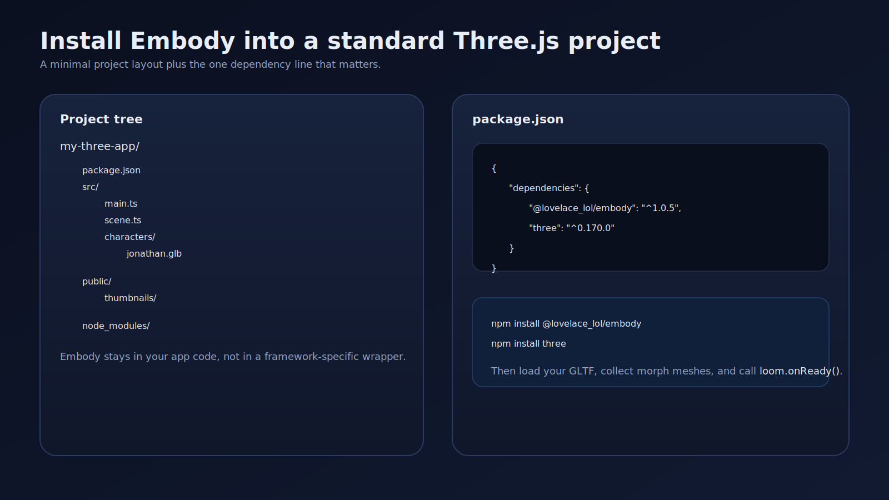
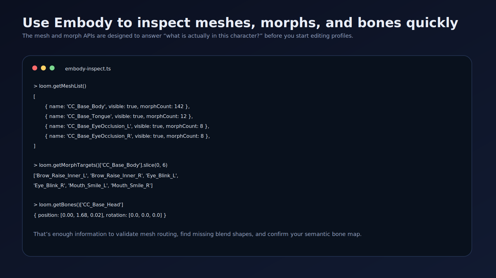
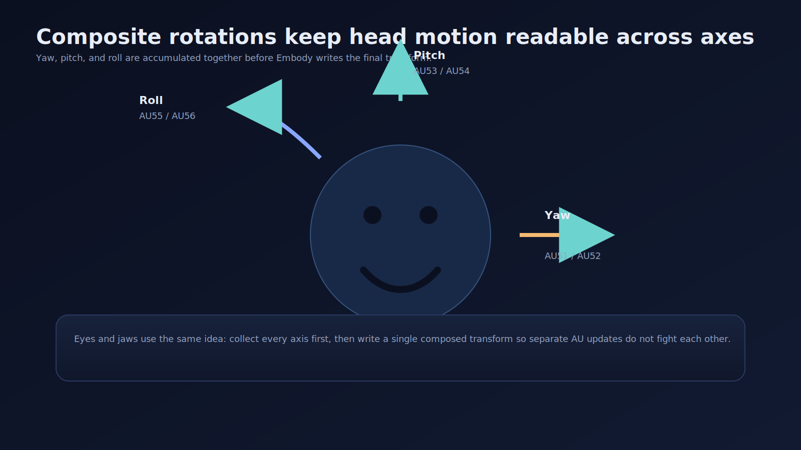
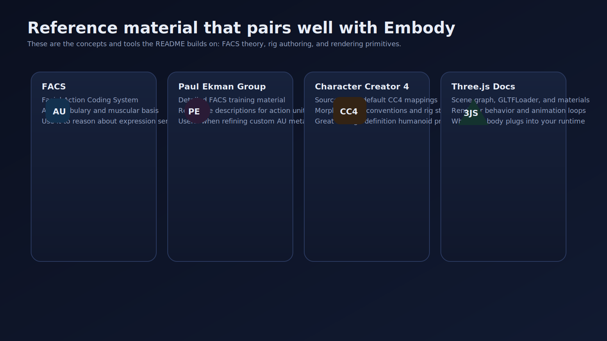

# Embody


The missing character controller for Three.js! Embody allows you to bring humanoid and animal characters to life. Embody is based on the Facial Action Coding System (FACS) as the basis of its mappings, providing a morph and bone mapping library for controlling high-definition 3D characters in Three.js.

Embody provides mappings that connect [Facial Action Coding System (FACS)](https://en.wikipedia.org/wiki/Facial_Action_Coding_System) Action Units to the morph targets and bone transforms found in 3d character assets. Instead of manually figuring out which blend shapes correspond to which facial movements, you can simply say `setAU(12, 0.8)` and the library handles the rest.

> **Note:** If you previously used the `loomlarge` npm package, it has been renamed to `@lovelace_lol/embody`.
>
> Continuous PR releases are published via [pkg.pr.new](https://pkg.pr.new/). Stable npm publishing is deferred until we have a release candidate; until then consumers should use git SHA pins or pkg.pr.new preview URLs. Install the [pkg-pr-new GitHub App](https://github.com/apps/pkg-pr-new) on this repository so PR workflows can publish previews.


---

## What Embody Covers

Embody is broader than a face-controller wrapper. The library spans four practical areas:
- Runtime control: Action Units, visemes, direct morphs, continuum pairs, composite rotations, transitions, and mixer playback.
- Rig configuration: built-in presets, profile overrides, preset lookup and extension, name resolution, viseme routing, mix weights, and skeletal-only preset support.
- Inspection and validation: mesh, morph, and bone discovery; preset-fit checks; correction suggestions; and full model analysis.
- Runtime tooling: mesh/material debugging, mixer animation clip helpers, hair physics, and region/geometry helpers for annotation or camera tooling.

## Reading Paths

Use the README in one of these paths:
- First successful character: [Installation & Setup](#1-installation--setup) -> [Using Presets](#2-using-presets) -> [Preset Selection & Validation](#3-preset-selection--validation) -> [Getting to Know Your Character](#4-getting-to-know-your-character) -> [Action Unit Control](#7-action-unit-control) -> [Viseme System](#12-viseme-system) -> [Transition System](#13-transition-system) -> [Baked Animations](#16-baked-animations)
- Retargeting an existing rig: [Using Presets](#2-using-presets) -> [Preset Selection & Validation](#3-preset-selection--validation) -> [Getting to Know Your Character](#4-getting-to-know-your-character) -> [Extending & Custom Presets](#5-extending--custom-presets)
- Skeletal-only character: [Creating Skeletal Animation Presets](#6-creating-skeletal-animation-presets) -> [Baked Animations](#16-baked-animations) -> [Regions & Geometry Helpers](#17-regions--geometry-helpers)
- Annotation or camera tooling: [Preset Selection & Validation](#3-preset-selection--validation) -> [Getting to Know Your Character](#4-getting-to-know-your-character) -> [Regions & Geometry Helpers](#17-regions--geometry-helpers)

## Demo Site Links

These demo site links open the LoomLarge drawer on the matching tab. The demo site currently supports stable `drawer` + `tab` deep links, so the README should lean on tab-specific links instead of pretending it can deep-link to a fully reconstructed authoring state.

| Goal | Open in LoomLarge |
|------|-------------------|
| Start with the main runtime surface | [Animation tab](https://www.characterloom.com/?drawer=open&tab=animation) |
| Inspect preset and profile settings | [Properties tab](https://www.characterloom.com/?drawer=open&tab=properties) |
| Inspect AU, morph, and bone routing | [Mappings tab](https://www.characterloom.com/?drawer=open&tab=mappings) |
| Inspect meshes and material state | [Meshes tab](https://www.characterloom.com/?drawer=open&tab=meshes) |
| Inspect resolved bones | [Bones tab](https://www.characterloom.com/?drawer=open&tab=bones) |
| Tune expressions and continuum pairs | [Action Units tab](https://www.characterloom.com/?drawer=open&tab=action-units) |
| Inspect lip-sync views | [Visemes tab](https://www.characterloom.com/?drawer=open&tab=visemes) and [Speech tab](https://www.characterloom.com/?drawer=open&tab=speech) |
| Tune hair behavior | [Hair tab](https://www.characterloom.com/?drawer=open&tab=hair) |

Most screenshots below were captured from LoomLarge with the matching tab open so the docs and the live product are easy to compare. The viseme grid image is the main exception: it still shows older labels from the captured UI, so the viseme table later in the README should be treated as the source of truth.

## Table of Contents

### Foundations

1. [Installation & Setup](#1-installation--setup)
2. [Using Presets](#2-using-presets)
3. [Preset Selection & Validation](#3-preset-selection--validation)
4. [Getting to Know Your Character](#4-getting-to-know-your-character)

### Advanced Authoring

5. [Extending & Custom Presets](#5-extending--custom-presets)
6. [Creating Skeletal Animation Presets](#6-creating-skeletal-animation-presets)

### Runtime Control

7. [Action Unit Control](#7-action-unit-control)
8. [Mix Weight System](#8-mix-weight-system)
9. [Composite Rotation System](#9-composite-rotation-system)
10. [Continuum Pairs](#10-continuum-pairs)
11. [Direct Morph Control](#11-direct-morph-control)
12. [Viseme System](#12-viseme-system)
13. [Transition System](#13-transition-system)
14. [Playback & State Control](#14-playback--state-control)
15. [Hair Physics](#15-hair-physics)
16. [Baked Animations](#16-baked-animations)

### Tooling & Reference

17. [Regions & Geometry Helpers](#17-regions--geometry-helpers)
18. [API Reference](#18-api-reference)

Additional:
- [Resources](#resources)
- [License](#license)

---

## 1. Installation & Setup

Open in LoomLarge: [Animation tab](https://www.characterloom.com/?drawer=open&tab=animation)



### Install the package

```bash
npm install @lovelace_lol/embody
```

### Peer dependency

Embody requires Three.js as a peer dependency:

```bash
npm install three
```

### Rust/Wasm core

Embody ships a generated Rust/Wasm core artifact in the npm package. The Three.js
controller initializes the parts it needs through the package facade, and direct
core consumers can explicitly initialize the Wasm entrypoint:

```typescript
import { initEmbodyCore } from '@lovelace_lol/embody/wasm';

const core = await initEmbodyCore();
const [left, right] = core.solve_bilateral_values(0.8, 0.25);
```

### Template skeleton fit metadata

Template skeleton fitting metadata is a host-neutral contract for recording how a
template skeleton should be previewed against a source character. It is metadata
for placement and QA only. It is not skinning data, bone weights, a rig
definition, or permission for the host to automatically bind the source mesh to
the template skeleton.

```typescript
import {
  TEMPLATE_SKELETON_FIT_METADATA_KIND,
  TEMPLATE_SKELETON_FIT_METADATA_VERSION,
  composeTemplateSkeletonFitTransform,
  validateTemplateSkeletonFitMetadata,
  type TemplateSkeletonFitMetadata,
} from '@lovelace_lol/embody/core/contracts';

const fitMetadata: TemplateSkeletonFitMetadata = {
  kind: TEMPLATE_SKELETON_FIT_METADATA_KIND,
  version: TEMPLATE_SKELETON_FIT_METADATA_VERSION,
  templateId: 'humanoid-basic',
  sourceCharacterId: 'character-1',
  verticalAxis: 'y',
  verticalAnchor: 'min',
  fit: {
    scale: 1.2,
    translation: { x: 0.1, y: 0.2, z: -0.1 },
    confidence: 0.75,
    meshHeight: 1.8,
    templateHeight: 1.5,
    crossAxisSpans: { x: 0.6, y: 1.8, z: 0.4 },
    status: 'estimated',
  },
  manualAdjustment: {
    scale: 1.05,
    translation: { x: 0.01, y: -0.02, z: 0.03 },
  },
};

const validation = validateTemplateSkeletonFitMetadata(fitMetadata);
const transform = composeTemplateSkeletonFitTransform(fitMetadata.fit, fitMetadata.manualAdjustment);
```

The required fields are:
- `kind`: must be `template-skeleton-fit` so hosts can distinguish this record
  from skinning, rig, animation, or mesh metadata.
- `version`: must match `TEMPLATE_SKELETON_FIT_METADATA_VERSION`. Unknown
  versions are rejected so migrations are explicit.
- `templateId` and `sourceCharacterId`: non-empty ids that let the host connect
  the fit to its template registry and source asset record.
- `verticalAxis`: one of `x`, `y`, or `z`; the source character axis used for
  height alignment.
- `verticalAnchor`: one of `min`, `center`, or `max`; the height anchor used
  when solving the initial placement.
- `fit`: the solver result, including positive `scale`, finite `translation`, a
  `confidence` value from `0` to `1`, positive mesh/template heights, non-negative
  cross-axis spans, and a stable status.
- `manualAdjustment`: optional host-authored corrections. `scale` must be
  positive and `translation` must be finite when present.

The stable status values are:
- `unfitted`: no usable solve exists yet.
- `estimated`: Embody produced an automatic fit that is ready for host preview.
- `manual-adjusted`: a user or host tool adjusted the automatic fit.
- `invalid`: the host should keep the metadata for inspection, but must not use
  it as a usable placement.

Hosts should render the composed transform in a preview or setup flow first. The
host owns any final retargeting, rig binding, or skin-binding decision, and should
keep those records separate from `TemplateSkeletonFitMetadata`.

### Basic setup (default host)

Most callers only need a container element and a character URL. Embody creates
the Three.js scene (renderer, camera, lights, shadow plane), loads the model,
frames the camera on it, starts a render loop, and binds the runtime:

```typescript
import { createCharacterHost } from '@lovelace_lol/embody';
// or: import { createCharacterHost } from '@lovelace_lol/embody/three';

const host = await createCharacterHost({
  container: document.getElementById('viewport')!,
  character: {
    modelUrl: '/characters/jonathan.glb',
    presetType: 'cc4',
  },
});

// host.engine is a ready Embody instance
host.engine.setAU(12, 0.8);

// later
host.dispose();
```

The default host renders on its own (`renderLoop: true`) and auto-frames the
camera on the model (`autoFrame: true`). Turn either off when you drive the
camera or render loop yourself (e.g. custom camera controls):

```typescript
const host = await createCharacterHost({
  container,
  character: { modelUrl: '/characters/jonathan.glb' },
  renderLoop: false, // you call renderer.render(scene, camera)
  autoFrame: false,  // you position the camera
});
```

With `external`, both default to `false` — your app owns rendering and camera.

### Advanced setup (bring your own Three.js scene)

Pass an existing scene/renderer/camera when you already own the WebGL host
(R3F, custom workbench, etc.). Embody still loads and binds the character:

```typescript
const host = await createCharacterHost({
  container: mountEl,
  character: { modelUrl: '/characters/jonathan.glb', presetType: 'cc4' },
  external: {
    scene,
    renderer,
    camera,
    // mountCanvas: true,  // optional
    // manageResize: true, // optional
  },
});
```

The lowest-level contract remains stable: `new Embody(...)` + `onReady({ meshes, model })`
if you want to own loading yourself.

```typescript
import * as THREE from 'three';
import { GLTFLoader } from 'three/addons/loaders/GLTFLoader.js';
import { Embody, collectMorphMeshes, CC4_PRESET } from '@lovelace_lol/embody';

const loom = new Embody({ profile: CC4_PRESET });
const loader = new GLTFLoader();
loader.load('/character.glb', (gltf) => {
  scene.add(gltf.scene);
  loom.onReady({ meshes: collectMorphMeshes(gltf.scene), model: gltf.scene });
});
```

If you’re implementing a custom renderer, target the `Embody` interface exported from `@lovelace_lol/embody` (legacy alias: `LoomLarge`).

### Lifecycle and update ownership

You have two valid integration patterns:
- External render loop: call `loom.update(deltaSeconds)` from your app’s main loop.
- Internal render loop: call `loom.start()` after `onReady()` and let Embody drive its own RAF-based updates.

The main lifecycle methods are:
- `onReady({ meshes, model })`: bind the loaded model to the engine
- `update(deltaSeconds)`: advance transitions, mixer playback, and runtime systems once
- `start()` / `stop()`: opt into or out of the internal loop
- `dispose()`: stop playback and release engine state when the character is torn down

### Quick start examples

Once your character is loaded, you can control facial expressions immediately:

```typescript
// Make the character smile
loom.setAU(12, 0.8);

// Raise eyebrows
loom.setAU(1, 0.6);
loom.setAU(2, 0.6);

// Blink
loom.setAU(45, 1.0);

// Open jaw
loom.setAU(26, 0.5);

// Turn head left
loom.setAU(51, 0.4);

// Look up
loom.setAU(63, 0.6);
```

Animate smoothly with transitions:

```typescript
// Smile over 200ms
await loom.transitionAU(12, 0.8, 200).promise;

// Then fade back to neutral
await loom.transitionAU(12, 0, 300).promise;
```

### The `collectMorphMeshes` helper

This utility function traverses a Three.js scene and returns all meshes that have `morphTargetInfluences` (i.e., blend shapes). It's the recommended way to gather meshes for Embody:

```typescript
import { collectMorphMeshes } from '@lovelace_lol/embody';

const meshes = collectMorphMeshes(gltf.scene);
// Returns: Array of THREE.Mesh objects with morph targets
```


---

## 2. Using Presets

Open in LoomLarge: [Properties tab](https://www.characterloom.com/?drawer=open&tab=properties) | [Mappings tab](https://www.characterloom.com/?drawer=open&tab=mappings)


Presets define how FACS Action Units map to your character's morph targets and bones. Embody ships with `CC4_PRESET` for Character Creator 4 characters.

### What's in a preset?

```typescript
import { CC4_PRESET } from '@lovelace_lol/embody';

// CC4_PRESET contains:
{
  auToMorphs: {
    // AU number → morph target names split by side
    1: { left: ['Brow_Raise_Inner_L'], right: ['Brow_Raise_Inner_R'], center: [] },
    12: { left: ['Mouth_Smile_L'], right: ['Mouth_Smile_R'], center: [] },
    45: { left: ['Eye_Blink_L'], right: ['Eye_Blink_R'], center: [] },
    // ... 87 AUs total
  },

  auToBones: {
    // AU number → array of bone bindings
    51: [{ node: 'HEAD', channel: 'ry', scale: -1, maxDegrees: 30 }],
    61: [{ node: 'EYE_L', channel: 'rz', scale: 1, maxDegrees: 25 }],
    // ... 32 bone bindings
  },

  boneNodes: {
    // Logical bone name → base node name used with bonePrefix
    'HEAD': 'Head',
    'JAW': 'JawRoot',
    'EYE_L': 'L_Eye',
    'EYE_R': 'R_Eye',
    'TONGUE': 'Tongue01',
  },

  bonePrefix: 'CC_Base_',
  suffixPattern: '_\\d+$|\\.\\d+$',

  visemeKeys: [
    // 15 viseme morph names for lip-sync
    'EE', 'Ah', 'Oh', 'OO', 'I',
    'U', 'W', 'L', 'F_V', 'Th',
    'S_Z', 'B_M_P', 'K_G_H_NG', 'AE', 'R'
  ],

  morphToMesh: {
    // Routes morph categories to specific meshes
    'face': ['CC_Base_Body'],
    'viseme': ['CC_Base_Body', 'CC_Base_Body_1'],
    'tongue': ['CC_Base_Tongue'],
    'eye': ['CC_Base_EyeOcclusion_1', 'CC_Base_EyeOcclusion_2'],
    'hair': ['Side_part_wavy_1', 'Side_part_wavy_2'],
  },

  auMixDefaults: {
    // Default morph/bone blend weights (0 = morph, 1 = bone)
    26: 0.5,  // Jaw drop: 50% morph, 50% bone
    51: 0.7,  // Head turn: 70% bone
  },

  auInfo: {
    // Metadata about each AU
    '12': {
      name: 'Lip Corner Puller',
      muscularBasis: 'zygomaticus major',
      faceArea: 'Lower',
      facePart: 'Mouth',
    },
    // ...
  }
}
```

### Name resolution and profile fields

The runtime resolves bone nodes by composing `bonePrefix + boneNodes[key] + boneSuffix`, then falling back to suffix-pattern matching when a model uses numbered exports such as `_01` or `.001`. The same prefix/suffix rules are used by validation and correction helpers, which is why `CC4_PRESET` can keep base bone names like `Head` and `JawRoot` instead of repeating the full node names everywhere.

For region and marker configs, `resolveBoneName()` treats any mapped bone name that already contains `_` or `.` as a fully qualified name and skips prefix/suffix composition.

Two caveats are worth calling out:
- `morphPrefix` and `morphSuffix` are part of `Profile`, but morph playback still resolves exact morph keys on the targeted meshes today. They are already used by validation and correction helpers.
- `leftMorphSuffixes` and `rightMorphSuffixes` are profile metadata for laterality detection in tooling, not core runtime behavior.

Other `Profile` fields that are easy to miss:
- `morphToMesh` routes categories such as `face`, `viseme`, `eye`, `tongue`, and `hair` to specific mesh names.
- `eyeMeshNodes` provides fallback eye nodes when a rig uses meshes instead of bones for eye control.
- `auMixDefaults` sets the default morph/bone blend weight per AU.
- `compositeRotations` defines the per-node pitch/yaw/roll axis layout used by the composite rotation system.
- `continuumPairs` and `continuumLabels` describe bidirectional AU pairs and their UI labels.
- `annotationRegions` defines the regions used by the marker and camera tooling, including per-region framing via `paddingFactor`.
- `hairPhysics` stores the mixer-driven hair defaults, including direction signs and morph target mappings.

For `annotationRegions`, `paddingFactor` is the camera framing multiplier for that region:
- values below `1` zoom in tighter
- values above `1` pull back to show more surrounding context
- profile overrides can replace it per region by name without copying the whole preset

### Passing a preset to Embody

```typescript
import { Embody, CC4_PRESET } from '@lovelace_lol/embody';

const loom = new Embody({ profile: CC4_PRESET });
```

You can also look up presets by name and extend them without cloning the full preset:

```typescript
import { Embody } from '@lovelace_lol/embody';

const loom = new Embody({
  presetType: 'cc4',
  profile: {
    auToMorphs: {
      12: { left: ['MySmile_Left'], right: ['MySmile_Right'], center: [] },
    },
  },
});
```

### Profiles (preset overrides)

A **profile** is a partial override object that extends a base preset. Use it to customize a single character without copying the full preset:

```typescript
import type { Profile } from '@lovelace_lol/embody';
import { Embody } from '@lovelace_lol/embody';

const DAISY_PROFILE: Profile = {
  morphToMesh: { face: ['Object_9'] },
  annotationRegions: [
    { name: 'face', bones: ['CC_Base_Head'] },
    { name: 'left_eye', paddingFactor: 0.9 },
    { name: 'right_eye', paddingFactor: 0.9 },
  ],
};

const loom = new Embody({
  presetType: 'cc4',
  profile: DAISY_PROFILE,
});
```

### Annotation configuration

`annotationRegions` is the Embody field for camera/marker region defaults and profile overrides.

If your app fetches a saved model/profile record from Firestore or another backend, use `extendProfileConfigWithPreset(...)` to build the runtime shape before handing that profile config to camera/marker tooling:

```typescript
import { extendProfileConfigWithPreset } from '@lovelace_lol/embody';

const savedConfig = await fetchProfileConfig();
const runtimeConfig = extendProfileConfigWithPreset({
  ...savedConfig,
  profilePresetId: savedConfig.profilePresetId ?? 'cc4',
});
```

`CharacterConfig`, `auPresetType`, and `extendCharacterConfigWithPreset(...)` are still exported as deprecated compatibility aliases for apps migrating from older LoomLarge-style character records. New Embody integrations should model presets as base profiles, pass profile overrides through `profile`, `annotationRegions`, or other `Profile` fields, and use `profilePresetId` for preset selection.

For the current runtime-oriented documentation, including:

- `paddingFactor`
- `cameraAngle`
- `cameraOffset`
- `style.lineDirection`
- the difference between `cameraAngle: 0` and omitting `cameraAngle`
- runtime compatibility and legacy `config.regions` fallback behavior

see [ANNOTATION_CONFIGURATION.md](./ANNOTATION_CONFIGURATION.md).


---

## 3. Preset Selection & Validation

Open in LoomLarge: [Properties tab](https://www.characterloom.com/?drawer=open&tab=properties) | [Mappings tab](https://www.characterloom.com/?drawer=open&tab=mappings) | [Bones tab](https://www.characterloom.com/?drawer=open&tab=bones)

Before you tune AUs or hand-edit a profile, confirm that you picked the right preset and that the model actually matches it. Embody exposes a full preset-selection and validation workflow, not just low-level control APIs.

### Looking Up and Extending Presets by Type

Use preset helpers when you want a stable entry point by model class instead of importing a preset constant directly:

```typescript
import {
  getPreset,
  getPresetWithProfile,
} from '@lovelace_lol/embody';

const preset = getPreset('cc4');

const extended = getPresetWithProfile('cc4', {
  morphToMesh: { face: ['Object_9'] },
});
```

### Validating the config itself

`validateMappingConfig()` checks the profile for internal consistency before you even compare it to a model:

```typescript
import { validateMappingConfig } from '@lovelace_lol/embody';

const consistency = validateMappingConfig(resolved);
console.log(consistency.errors, consistency.warnings);
```

### Checking a model against a preset

```typescript
import * as THREE from 'three';
import {
  validateMappings,
  isPresetCompatible,
  generateMappingCorrections,
} from '@lovelace_lol/embody';

const skinnedMesh = gltf.scene.getObjectByProperty('type', 'SkinnedMesh') as THREE.SkinnedMesh | undefined;
const skeleton = skinnedMesh?.skeleton ?? null;

const validation = validateMappings(meshes, skeleton, resolved, {
  suggestCorrections: true,
});

const compatible = isPresetCompatible(meshes, skeleton, resolved);
const corrections = generateMappingCorrections(meshes, skeleton, resolved, {
  useResolvedNames: true,
});
```

### Suggesting the best preset from a candidate set

```typescript
import {
  CC4_PRESET,
  BETTA_FISH_PRESET,
  suggestBestPreset,
} from '@lovelace_lol/embody';

const best = suggestBestPreset(meshes, skeleton, [
  CC4_PRESET,
  BETTA_FISH_PRESET,
]);
```

### Running a full model analysis

```typescript
import {
  analyzeModel,
  extractFromGLTF,
  extractModelData,
} from '@lovelace_lol/embody';

const extracted = extractFromGLTF(gltf);
const runtimeData = extractModelData(gltf.scene, meshes, gltf.animations);

const report = await analyzeModel({
  source: { type: 'gltf', gltf },
  preset: resolved,
  suggestCorrections: true,
});

console.log(report.summary, report.overallScore);
```

Use this section when you need to:
- choose between built-in presets before wiring the character into your app
- lint a preset/profile for broken internal references
- measure how well a preset matches an imported model
- generate correction suggestions before building a custom profile

---

## 4. Getting to Know Your Character

Open in LoomLarge: [Meshes tab](https://www.characterloom.com/?drawer=open&tab=meshes) | [Bones tab](https://www.characterloom.com/?drawer=open&tab=bones) | [Mappings tab](https://www.characterloom.com/?drawer=open&tab=mappings)



Before customizing presets or extending mappings, it's helpful to understand what's actually in your character model. Embody provides several methods to inspect meshes, morph targets, and bones.

### Listing meshes

Get all meshes in your character with their visibility and morph target counts:

```typescript
const meshes = loom.getMeshList();
console.log(meshes);
// [
//   { name: 'CC_Base_Body', visible: true, morphCount: 142 },
//   { name: 'CC_Base_Tongue', visible: true, morphCount: 12 },
//   { name: 'CC_Base_EyeOcclusion_1', visible: true, morphCount: 8 },
//   { name: 'CC_Base_EyeOcclusion_2', visible: true, morphCount: 8 },
//   { name: 'Male_Bushy_1', visible: true, morphCount: 142 },
//   ...
// ]
```

### Listing morph targets

Get all morph target names grouped by mesh:

```typescript
const morphs = loom.getMorphTargets();
console.log(morphs);
// {
//   'CC_Base_Body': [
//     'A01_Brow_Inner_Up', 'A02_Brow_Down_Left', 'A02_Brow_Down_Right',
//     'A04_Brow_Outer_Up_Left', 'A04_Brow_Outer_Up_Right',
//     'Mouth_Smile_L', 'Mouth_Smile_R', 'Eye_Blink_L', 'Eye_Blink_R',
//     ...
//   ],
//   'CC_Base_Tongue': [
//     'V_Tongue_Out', 'V_Tongue_Up', 'V_Tongue_Down', ...
//   ],
//   ...
// }
```

This is invaluable when creating custom presets—you need to know the exact morph target names your character uses.

### Listing bones

Get all resolved bones with their current positions and rotations (in degrees):

```typescript
const bones = loom.getBones();
console.log(bones);
// {
//   'HEAD': { position: [0, 156.2, 0], rotation: [0, 0, 0] },
//   'JAW': { position: [0, 154.1, 2.3], rotation: [0, 0, 0] },
//   'EYE_L': { position: [-3.2, 160.5, 8.1], rotation: [0, 0, 0] },
//   'EYE_R': { position: [3.2, 160.5, 8.1], rotation: [0, 0, 0] },
//   'TONGUE': { position: [0, 152.3, 1.8], rotation: [0, 0, 0] },
// }
```

### Listing morph target indices

Use the index view when you need to work with `setMorphInfluence()` or build tools that operate on morph slots directly:

```typescript
const indices = loom.getMorphTargetIndices();
console.log(indices);
// {
//   'CC_Base_Body': [
//     { index: 0, name: 'A01_Brow_Inner_Up' },
//     { index: 1, name: 'A02_Brow_Down_Left' },
//     ...
//   ],
// }
```

### Validating and analyzing the model you loaded

Use the extraction and validation helpers when inspection needs to turn into preset-fit analysis:

```typescript
import {
  extractFromGLTF,
  extractModelData,
  analyzeModel,
  validateMappings,
  generateMappingCorrections,
  getPreset,
} from '@lovelace_lol/embody';

const preset = getPreset('cc4');
const modelData = extractModelData(model, meshes, animations);
const gltfData = extractFromGLTF(gltf); // Same ModelData shape, one-step GLTF wrapper

const analysis = await analyzeModel({
  source: { type: 'gltf', gltf },
  preset,
  suggestCorrections: true,
});

// Validate against lower-level mesh + skeleton inputs when you already have them
const validation = validateMappings(meshes, skeleton, preset, { suggestCorrections: true });
const corrections = generateMappingCorrections(meshes, skeleton, preset, { useResolvedNames: true });
```

If you already have a `ModelData` bundle, `analyzeModel()` is the higher-level path; `validateMappings()` and `generateMappingCorrections()` are intentionally lower-level mesh/skeleton helpers.

Use these helpers to:
- Extract raw model facts with `extractModelData(model, meshes?, animations?)` or `extractFromGLTF(gltf)`
- Validate a preset against mesh/skeleton data with `validateMappings(meshes, skeleton, preset, options)`
- Generate best-effort fixes with `generateMappingCorrections(meshes, skeleton, preset, options)`
- Run a single end-to-end pass with `analyzeModel({ source, preset, suggestCorrections })`

`validateMappings()` returns a `ValidationResult` with:
- `valid` and `score`
- `missingMorphs`, `missingBones`, `foundMorphs`, `foundBones`
- `missingMeshes`, `foundMeshes`, `unmappedMorphs`, `unmappedBones`, `unmappedMeshes`
- `warnings`
- optional `suggestedConfig`, `corrections`, and `unresolved` when suggestion mode is enabled

`generateMappingCorrections()` returns:
- `correctedConfig`
- `corrections`
- `unresolved`

`analyzeModel()` returns a `ModelAnalysisReport` containing the extracted model data, optional validation results, animation summary, `overallScore`, and a plain-language `summary`.

### Humanoid skeleton templates

Embody owns reusable humanoid skeleton templates and the extraction path for
turning a skinned character into template data. Host apps can select a template
by id, derive its rest bounds for fitting, or seed validation/mapping UI with
the template bone list:

```typescript
import {
  JONATHAN_HUMANOID_SKELETON_TEMPLATE,
  computeHumanoidSkeletonTemplateRestBounds,
  createValidationSkeletonFromHumanoidTemplate,
  getHumanoidSkeletonTemplate,
} from '@lovelace_lol/embody';

const template = getHumanoidSkeletonTemplate('jonathan-cc-base') ?? JONATHAN_HUMANOID_SKELETON_TEMPLATE;
const templateBounds = computeHumanoidSkeletonTemplateRestBounds(template);
const validationSkeleton = createValidationSkeletonFromHumanoidTemplate(template);
```

When a new skinned GLB should become a reusable template, extract its skeleton
into `src/skeletonTemplates/data`:

```bash
npm run extract:humanoid-skeleton-template -- ../LoomLarge/frontend/public/characters/jonathan_new.glb src/skeletonTemplates/data/jonathan-cc-base.json --id jonathan-cc-base --source-character-id jonathan --skin-name Armature
```

The extracted template records joint names, parent links, and local
translations. It is fit/mapping metadata only; it does not include skin weights,
inverse bind matrices, or pose retargeting data.

### Controlling mesh visibility

Hide or show individual meshes:

```typescript
// Hide hair mesh
loom.setMeshVisible('Side_part_wavy_1', false);

// Show it again
loom.setMeshVisible('Side_part_wavy_1', true);
```

### Highlighting a mesh

Use highlighting when you need to confirm which mesh a profile field or morph category is actually targeting:

```typescript
// Highlight one mesh
loom.highlightMesh('CC_Base_Body');

// Clear all highlights
loom.highlightMesh(null);
```

### Adjusting material properties

Fine-tune render order, transparency, and blending for each mesh:

```typescript
// Get current material config
const config = loom.getMeshMaterialConfig('CC_Base_Body');
console.log(config);
// {
//   renderOrder: 0,
//   transparent: false,
//   opacity: 1,
//   depthWrite: true,
//   depthTest: true,
//   blending: 'Normal'
// }

// Set custom material config
loom.setMeshMaterialConfig('CC_Base_EyeOcclusion_1', {
  renderOrder: 10,
  transparent: true,
  opacity: 0.8,
  blending: 'Normal'  // 'Normal', 'Additive', 'Subtractive', 'Multiply', 'None'
});
```

This is especially useful for:
- Fixing render order issues (eyebrows behind hair, etc.)
- Making meshes semi-transparent for debugging
- Adjusting blending modes for special effects


---

## 5. Extending & Custom Presets

Open in LoomLarge: [Properties tab](https://www.characterloom.com/?drawer=open&tab=properties) | [Mappings tab](https://www.characterloom.com/?drawer=open&tab=mappings)


### Extending an existing preset

Use `extendPresetWithProfile` to override specific mappings while keeping the rest:

```typescript
import { CC4_PRESET, extendPresetWithProfile } from '@lovelace_lol/embody';

const MY_PRESET = extendPresetWithProfile(CC4_PRESET, {

  // Override AU12 (smile) with custom morph names
  auToMorphs: {
    12: { left: ['MySmile_Left'], right: ['MySmile_Right'], center: [] },
  },

  // Add a new bone binding
  auToBones: {
    99: [{ node: 'CUSTOM_BONE', channel: 'ry', scale: 1, maxDegrees: 45 }],
  },

  // Update bone node paths
  boneNodes: {
    'CUSTOM_BONE': 'MyRig_CustomBone',
  },
});

const loom = new Embody({ profile: MY_PRESET });
```

### Creating a preset from scratch

```typescript
import type { Profile } from '@lovelace_lol/embody';

const CUSTOM_PRESET: Profile = {
  auToMorphs: {
    1: { left: ['brow_inner_up_L'], right: ['brow_inner_up_R'], center: [] },
    2: { left: ['brow_outer_up_L'], right: ['brow_outer_up_R'], center: [] },
    12: { left: ['mouth_smile_L'], right: ['mouth_smile_R'], center: [] },
    45: { left: ['eye_blink_L'], right: ['eye_blink_R'], center: [] },
  },

  auToBones: {
    51: [{ node: 'HEAD', channel: 'ry', scale: -1, maxDegrees: 30 }],
    52: [{ node: 'HEAD', channel: 'ry', scale: 1, maxDegrees: 30 }],
  },

  boneNodes: {
    'HEAD': 'head_bone',
    'JAW': 'jaw_bone',
  },

  visemeKeys: ['aa', 'ee', 'ih', 'oh', 'oo'],

  morphToMesh: {
    'face': ['body_mesh'],
  },
};
```

### Changing presets at runtime

```typescript
// Switch to a different preset
loom.setProfile(ANOTHER_PRESET);

// Get current mappings
const current = loom.getProfile();
```


---

## 6. Creating Skeletal Animation Presets

Open in LoomLarge: [Bones tab](https://www.characterloom.com/?drawer=open&tab=bones) | [Action Units tab](https://www.characterloom.com/?drawer=open&tab=action-units) | [Animation tab](https://www.characterloom.com/?drawer=open&tab=animation)


Embody isn't limited to humanoid characters with morph targets. You can create presets for any 3D model that uses skeletal animation, such as fish, animals, or fantasy creatures. This section explains how to create a preset for a betta fish model that has no morph targets—only bone-driven animation.

### Understanding skeletal-only models

Some models (like fish) rely entirely on bone rotations for animation:
- **No morph targets:** All movement is skeletal
- **Hierarchical bones:** Fins and body parts follow parent rotations
- **Custom "Action Units":** Instead of FACS AUs, you define model-specific actions

### Example: Betta Fish Preset

Here's a complete example of a preset for a betta fish:

```typescript
import type { BoneBinding, AUInfo, CompositeRotation } from '@lovelace_lol/embody';

// Define semantic bone mappings
export const FISH_BONE_NODES = {
  ROOT: 'Armature_rootJoint',
  BODY_ROOT: 'Bone_Armature',
  HEAD: 'Bone001_Armature',
  BODY_FRONT: 'Bone002_Armature',
  BODY_MID: 'Bone003_Armature',
  BODY_BACK: 'Bone004_Armature',
  TAIL_BASE: 'Bone005_Armature',

  // Pectoral fins (side fins)
  PECTORAL_L: 'Bone046_Armature',
  PECTORAL_R: 'Bone047_Armature',

  // Dorsal fin (top fin)
  DORSAL_ROOT: 'Bone006_Armature',

  // Eyes (single mesh for both)
  EYE_L: 'EYES_0',
  EYE_R: 'EYES_0',
} as const;

// Define custom fish actions (analogous to FACS AUs)
export enum FishAction {
  // Body orientation
  TURN_LEFT = 2,
  TURN_RIGHT = 3,
  PITCH_UP = 4,
  PITCH_DOWN = 5,
  ROLL_LEFT = 6,
  ROLL_RIGHT = 7,

  // Tail movements
  TAIL_SWEEP_LEFT = 12,
  TAIL_SWEEP_RIGHT = 13,
  TAIL_FIN_SPREAD = 14,
  TAIL_FIN_CLOSE = 15,

  // Pectoral fins
  PECTORAL_L_UP = 20,
  PECTORAL_L_DOWN = 21,
  PECTORAL_R_UP = 22,
  PECTORAL_R_DOWN = 23,

  // Eye rotation
  EYE_LEFT = 61,
  EYE_RIGHT = 62,
  EYE_UP = 63,
  EYE_DOWN = 64,
}
```

### Defining bone bindings for movement

Map each action to bone rotations:

```typescript
export const FISH_BONE_BINDINGS: Record<number, BoneBinding[]> = {
  // Turn the fish left - affects head, front body, and mid body
  [FishAction.TURN_LEFT]: [
    { node: 'HEAD', channel: 'ry', scale: 1, maxDegrees: 30 },
    { node: 'BODY_FRONT', channel: 'ry', scale: 1, maxDegrees: 14 },
    { node: 'BODY_MID', channel: 'ry', scale: 1, maxDegrees: 5 },
  ],

  // Tail sweep left - cascading motion through tail bones
  [FishAction.TAIL_SWEEP_LEFT]: [
    { node: 'BODY_BACK', channel: 'rz', scale: 1, maxDegrees: 15 },
    { node: 'TAIL_BASE', channel: 'rz', scale: 1, maxDegrees: 30 },
    { node: 'TAIL_TOP', channel: 'rz', scale: 1, maxDegrees: 20 },
    { node: 'TAIL_MID', channel: 'rz', scale: 1, maxDegrees: 20 },
  ],

  // Pectoral fin movements
  [FishAction.PECTORAL_L_UP]: [
    { node: 'PECTORAL_L', channel: 'rz', scale: 1, maxDegrees: 40 },
    { node: 'PECTORAL_L_MID', channel: 'rz', scale: 1, maxDegrees: 20 },
  ],

  // Eye rotation
  [FishAction.EYE_LEFT]: [
    { node: 'EYE_L', channel: 'ry', scale: 1, maxDegrees: 25 },
  ],
};
```

### Composite rotations for multi-axis control

Define how multiple AUs combine for smooth rotation:

```typescript
export const FISH_COMPOSITE_ROTATIONS: CompositeRotation[] = [
  {
    node: 'HEAD',
    pitch: {
      aus: [FishAction.PITCH_UP, FishAction.PITCH_DOWN],
      axis: 'rx',
      negative: FishAction.PITCH_DOWN,
      positive: FishAction.PITCH_UP
    },
    yaw: {
      aus: [FishAction.TURN_LEFT, FishAction.TURN_RIGHT],
      axis: 'ry',
      negative: FishAction.TURN_LEFT,
      positive: FishAction.TURN_RIGHT
    },
    roll: null,
  },
  {
    node: 'TAIL_BASE',
    pitch: null,
    yaw: null,
    roll: {
      aus: [FishAction.TAIL_SWEEP_LEFT, FishAction.TAIL_SWEEP_RIGHT],
      axis: 'rz',
      negative: FishAction.TAIL_SWEEP_RIGHT,
      positive: FishAction.TAIL_SWEEP_LEFT
    },
  },
  {
    node: 'EYE_L',
    pitch: {
      aus: [FishAction.EYE_UP, FishAction.EYE_DOWN],
      axis: 'rx',
      negative: FishAction.EYE_DOWN,
      positive: FishAction.EYE_UP
    },
    yaw: {
      aus: [FishAction.EYE_LEFT, FishAction.EYE_RIGHT],
      axis: 'ry',
      negative: FishAction.EYE_RIGHT,
      positive: FishAction.EYE_LEFT
    },
    roll: null,
  },
];
```

### Action metadata for UI and debugging

```typescript
export const FISH_AU_INFO: Record<string, AUInfo> = {
  '2': { id: '2', name: 'Turn Left', facePart: 'Body Orientation' },
  '3': { id: '3', name: 'Turn Right', facePart: 'Body Orientation' },
  '4': { id: '4', name: 'Pitch Up', facePart: 'Body Orientation' },
  '5': { id: '5', name: 'Pitch Down', facePart: 'Body Orientation' },
  '12': { id: '12', name: 'Tail Sweep Left', facePart: 'Tail' },
  '13': { id: '13', name: 'Tail Sweep Right', facePart: 'Tail' },
  '20': { id: '20', name: 'Pectoral L Up', facePart: 'Pectoral Fins' },
  '61': { id: '61', name: 'Eyes Left', facePart: 'Eyes' },
  // ... more actions
};
```

### Continuum pairs for bidirectional sliders

```typescript
export const FISH_CONTINUUM_PAIRS_MAP: Record<number, {
  pairId: number;
  isNegative: boolean;
  axis: 'pitch' | 'yaw' | 'roll';
  node: string;
}> = {
  [FishAction.TURN_LEFT]: {
    pairId: FishAction.TURN_RIGHT,
    isNegative: true,
    axis: 'yaw',
    node: 'HEAD'
  },
  [FishAction.TURN_RIGHT]: {
    pairId: FishAction.TURN_LEFT,
    isNegative: false,
    axis: 'yaw',
    node: 'HEAD'
  },
  [FishAction.TAIL_SWEEP_LEFT]: {
    pairId: FishAction.TAIL_SWEEP_RIGHT,
    isNegative: true,
    axis: 'roll',
    node: 'TAIL_BASE'
  },
  // ... more pairs
};
```

### Creating the final preset config

```typescript
export const FISH_AU_MAPPING_CONFIG = {
  auToBones: FISH_BONE_BINDINGS,
  boneNodes: FISH_BONE_NODES,
  auToMorphs: {} as Record<number, { left: string[]; right: string[]; center: string[] }>,  // No morph targets
  morphToMesh: {} as Record<string, string[]>,
  visemeKeys: [] as string[],  // Fish don't speak!
  auInfo: FISH_AU_INFO,
  compositeRotations: FISH_COMPOSITE_ROTATIONS,
  eyeMeshNodes: { LEFT: 'EYES_0', RIGHT: 'EYES_0' },
};
```

### Using the fish preset

```typescript
import { Embody } from '@lovelace_lol/embody';
import { FISH_AU_MAPPING_CONFIG, FishAction } from './presets/bettaFish';

const fishController = new Embody({
  profile: FISH_AU_MAPPING_CONFIG
});

// Load the fish model
loader.load('/characters/betta/scene.gltf', (gltf) => {
  const meshes = collectMorphMeshes(gltf.scene);  // Will be empty for fish
  fishController.onReady({ meshes, model: gltf.scene });

  // Control the fish!
  fishController.setAU(FishAction.TURN_LEFT, 0.5);      // Turn left
  fishController.setAU(FishAction.TAIL_SWEEP_LEFT, 0.8); // Sweep tail
  fishController.setAU(FishAction.PECTORAL_L_UP, 0.6);   // Raise left fin

  // Smooth transitions
  await fishController.transitionAU(FishAction.TURN_RIGHT, 1.0, 500).promise;
});
```

### Creating swimming animations

Use continuum controls for natural swimming motion:

```typescript
// Use setContinuum for paired actions
fishController.setContinuum(
  FishAction.TURN_LEFT,
  FishAction.TURN_RIGHT,
  0.3  // Slight turn right
);

// Animate swimming with oscillating tail
async function swimCycle() {
  while (true) {
    await fishController.transitionContinuum(
      FishAction.TAIL_SWEEP_LEFT,
      FishAction.TAIL_SWEEP_RIGHT,
      0.8,  // Sweep right
      300
    ).promise;

    await fishController.transitionContinuum(
      FishAction.TAIL_SWEEP_LEFT,
      FishAction.TAIL_SWEEP_RIGHT,
      -0.8, // Sweep left
      300
    ).promise;
  }
}
```


---

## 7. Action Unit Control

Open in LoomLarge: [Action Units tab](https://www.characterloom.com/?drawer=open&tab=action-units)


Action Units are the core of FACS. Each AU represents a specific muscular movement of the face.

### Setting an AU immediately

```typescript
// Set AU12 (smile) to 80% intensity
loom.setAU(12, 0.8);

// Set AU45 (blink) to full intensity
loom.setAU(45, 1.0);

// Set to 0 to deactivate
loom.setAU(12, 0);
```

### Transitioning an AU over time

```typescript
// Animate AU12 to 0.8 over 200ms
const handle = loom.transitionAU(12, 0.8, 200);

// Wait for completion
await handle.promise;

// Or chain transitions
loom.transitionAU(12, 1.0, 200).promise.then(() => {
  loom.transitionAU(12, 0, 300);  // Fade out
});
```

### Getting the current AU value

```typescript
const smileAmount = loom.getAU(12);
console.log(`Current smile: ${smileAmount}`);
```

### Asymmetric control with balance

Many AUs have left and right variants (e.g., `Mouth_Smile_L` and `Mouth_Smile_R`). The `balance` parameter lets you control them independently:

```typescript
// Balance range: -1 (left only) to +1 (right only), 0 = both equal

// Smile on both sides equally
loom.setAU(12, 0.8, 0);

// Smile only on left side
loom.setAU(12, 0.8, -1);

// Smile only on right side
loom.setAU(12, 0.8, 1);

// 70% left, 30% right
loom.setAU(12, 0.8, -0.4);
```

### String-based side selection

You can also specify the side directly in the AU ID:

```typescript
// These are equivalent:
loom.setAU('12L', 0.8);    // Left side only
loom.setAU(12, 0.8, -1);   // Left side only

loom.setAU('12R', 0.8);    // Right side only
loom.setAU(12, 0.8, 1);    // Right side only
```

---

## 8. Mix Weight System

Open in LoomLarge: [Action Units tab](https://www.characterloom.com/?drawer=open&tab=action-units)


Some AUs can be driven by both morph targets (blend shapes) AND bone rotations. The mix weight controls the blend between them.

### Why mix weights?

Take jaw opening (AU26) as an example:
- **Morph-only (weight 0)**: Vertices deform to show open mouth, but jaw bone doesn't move
- **Bone-only (weight 1)**: Jaw bone rotates down, but no soft tissue deformation
- **Mixed (weight 0.5)**: Both contribute equally for realistic results

### Setting mix weights

```typescript
// Get the default mix weight for AU26
const weight = loom.getAUMixWeight(26);  // e.g., 0.5

// Set to pure morph
loom.setAUMixWeight(26, 0);

// Set to pure bone
loom.setAUMixWeight(26, 1);

// Set to 70% bone, 30% morph
loom.setAUMixWeight(26, 0.7);
```

### Which AUs support mixing?

Only AUs that have both `auToMorphs` AND `auToBones` entries support mixing. Common examples:
- AU26 (Jaw Drop)
- AU27 (Mouth Stretch)
- AU51-56 (Head movements)
- AU61-72 (Shared + independent eye movements)

```typescript
import { isMixedAU } from '@lovelace_lol/embody';

if (isMixedAU(26)) {
  console.log('AU26 supports morph/bone mixing');
}
```

---

## 9. Composite Rotation System

Open in LoomLarge: [Action Units tab](https://www.characterloom.com/?drawer=open&tab=action-units) | [Bones tab](https://www.characterloom.com/?drawer=open&tab=bones)



Bones like the head and eyes need multi-axis rotation (pitch, yaw, roll). The composite rotation system handles this automatically.

### How it works

When you set an AU that affects a bone rotation, Embody:
1. Queues the rotation update in `pendingCompositeNodes`
2. At the end of `update()`, calls `flushPendingComposites()`
3. Applies all three axes (pitch, yaw, roll) together to prevent gimbal issues

### Supported bones and their axes

| Bone | Pitch (X) | Yaw (Y) | Roll (Z) |
|------|-----------|---------|----------|
| HEAD | AU53 (up) / AU54 (down) | AU51 (left) / AU52 (right) | AU55 (tilt left) / AU56 (tilt right) |
| EYE_L | AU63 (up) / AU64 (down) | AU61 (left) / AU62 (right) | - |
| EYE_R | AU63 (up) / AU64 (down) | AU61 (left) / AU62 (right) | - |
| JAW | AU25-27 (open) | AU30 (left) / AU35 (right) | - |
| TONGUE | AU37 (up) / AU38 (down) | AU39 (left) / AU40 (right) | AU41 / AU42 (tilt) |

### Example: Moving the head

```typescript
// Turn head left 50%
loom.setAU(51, 0.5);

// Turn head right 50%
loom.setAU(52, 0.5);

// Tilt head up 30%
loom.setAU(53, 0.3);

// Combine: turn left AND tilt up
loom.setAU(51, 0.5);
loom.setAU(53, 0.3);
// Both are applied together in a single composite rotation
```

### Example: Eye gaze

```typescript
// Look left
loom.setAU(61, 0.7);

// Look right
loom.setAU(62, 0.7);

// Look up
loom.setAU(63, 0.5);

// Look down-right (combined)
loom.setAU(62, 0.6);
loom.setAU(64, 0.4);
```

---

## 10. Continuum Pairs

Open in LoomLarge: [Action Units tab](https://www.characterloom.com/?drawer=open&tab=action-units)


Continuum pairs are bidirectional AU pairs that represent opposite directions on the same axis. They're linked so that activating one should deactivate the other.

### Pair mappings

| Pair | Description |
|------|-------------|
| AU51 ↔ AU52 | Head turn left / right |
| AU53 ↔ AU54 | Head up / down |
| AU55 ↔ AU56 | Head tilt left / right |
| AU61 ↔ AU62 | Eyes look left / right |
| AU63 ↔ AU64 | Eyes look up / down |
| AU30 ↔ AU35 | Jaw shift left / right |
| AU37 ↔ AU38 | Tongue up / down |
| AU39 ↔ AU40 | Tongue left / right |
| AU73 ↔ AU74 | Tongue narrow / wide |
| AU76 ↔ AU77 | Tongue tip up / down |

### Negative value shorthand (recommended)

The simplest way to work with continuum pairs is using **negative values**. When you pass a negative value to `setAU()` or `transitionAU()`, the engine automatically activates the paired AU instead:

```typescript
// Head looking left at 50% (AU51 is "head left")
loom.setAU(51, 0.5);

// Head looking right at 50% - just use a negative value!
loom.setAU(51, -0.5);  // Automatically activates AU52 at 0.5

// This is equivalent to manually setting the pair:
loom.setAU(51, 0);
loom.setAU(52, 0.5);
```

This works for transitions too:

```typescript
// Animate head from left to right over 500ms
await loom.transitionAU(51, 0.5, 250).promise;   // Turn left
await loom.transitionAU(51, -0.5, 500).promise;  // Turn right (activates AU52)
```

### The setContinuum method

For explicit continuum control, use `setContinuum()` with a single value from -1 to +1:

```typescript
// setContinuum(negativeAU, positiveAU, value)
// value: -1 = full negative, 0 = neutral, +1 = full positive

// Head centered
loom.setContinuum(51, 52, 0);

// Head 50% left
loom.setContinuum(51, 52, -0.5);

// Head 70% right
loom.setContinuum(51, 52, 0.7);
```

With smooth animation:

```typescript
// Animate head from current position to 80% right over 300ms
await loom.transitionContinuum(51, 52, 0.8, 300).promise;

// Animate eyes to look left over 200ms
await loom.transitionContinuum(61, 62, -0.6, 200).promise;
```

### Manual pair management

You can also manually manage pairs by setting each AU individually:

```typescript
// Head looking left at 50%
loom.setAU(51, 0.5);
loom.setAU(52, 0);  // Right should be 0

// Head looking right at 70%
loom.setAU(51, 0);  // Left should be 0
loom.setAU(52, 0.7);
```

### The CONTINUUM_PAIRS_MAP

You can access pair information programmatically:

```typescript
import { CONTINUUM_PAIRS_MAP } from '@lovelace_lol/embody';

const pair = CONTINUUM_PAIRS_MAP[51];
// { pairId: 52, isNegative: true, axis: 'yaw', node: 'HEAD' }
```

---

## 11. Direct Morph Control

Open in LoomLarge: [Meshes tab](https://www.characterloom.com/?drawer=open&tab=meshes) | [Mappings tab](https://www.characterloom.com/?drawer=open&tab=mappings)


Sometimes you need to control morph targets directly by name, bypassing the AU system.

### Setting a morph immediately

```typescript
// Set a specific morph to 50%
loom.setMorph('Mouth_Smile_L', 0.5);

// Set on specific meshes only
loom.setMorph('Mouth_Smile_L', 0.5, ['CC_Base_Body']);
```

### Transitioning a morph

```typescript
// Animate morph over 200ms
const handle = loom.transitionMorph('Mouth_Smile_L', 0.8, 200);

// With mesh targeting
loom.transitionMorph('Eye_Blink_L', 1.0, 100, ['CC_Base_Body']);

// Wait for completion
await handle.promise;
```

### Resolving current morph targets

```typescript
const targets = loom.resolveMorphTargets('Mouth_Smile_L', ['CC_Base_Body']);
const value = targets.length > 0 ? (targets[0].infl[targets[0].idx] ?? 0) : 0;
```

### Adding runtime morph targets

Generated or sidecar morph targets can be registered after a model loads. Deltas use the same relative `POSITION` format as glTF morph targets: one XYZ delta per base mesh vertex. Optional `normal` and `tangent` deltas can be supplied when available.

```typescript
const index = loom.addMorphTarget({
  meshName: 'CC_Base_Body',
  name: 'BodyType_Muscular',
  position: bodyTypeMuscularDeltas,
});

loom.setMorphInfluence(index, 0.6, ['CC_Base_Body']);
loom.setMorph('BodyType_Muscular', 0.6, ['CC_Base_Body']);
```

By default, Embody replaces and disposes the mesh `BufferGeometry` before appending morph attributes. This is intentional: Three.js does not support mutating `geometry.morphAttributes` in place after a geometry has rendered. For pre-render authoring paths, pass `{ forceGeometryReplacement: false }`.

If you need a named slot before real deltas are available, use `ensureMorphInfluence(meshName, morphName)`. It creates a zero-delta target and returns the assigned `morphTargetInfluences` index. After external code changes morph dictionaries or geometry, call `refreshMorphTargets()` so AU, viseme, hair, and clip-building caches see the updated targets.

### Morph caching

Embody caches morph target lookups for performance. The first time you access a morph, it searches all meshes and caches the index. Subsequent accesses are O(1).

---

## 12. Viseme System

Open in LoomLarge: [Visemes tab](https://www.characterloom.com/?drawer=open&tab=visemes) | [Speech tab](https://www.characterloom.com/?drawer=open&tab=speech)


This screenshot was captured before the viseme label refresh, so some cards still show legacy names such as `Er`, `IH`, and `W_OO`. Treat the table below as the source of truth for the current exported `VISEME_KEYS` order.

Visemes are mouth shapes used for lip-sync. Embody includes 15 visemes with automatic jaw coupling.

### The 15 visemes

The `VISEME_KEYS` export uses unprefixed keys in this order.

| Index | Key | Phoneme Example |
|-------|-----|-----------------|
| 0 | EE | "b**ee**" |
| 1 | Ah | "f**a**ther" |
| 2 | Oh | "g**o**" |
| 3 | OO | "t**oo**" |
| 4 | I | "s**i**t" |
| 5 | U | "fl**u**te" |
| 6 | W | "**w**e" |
| 7 | L | "**l**ip" |
| 8 | F_V | "**f**un, **v**an" |
| 9 | Th | "**th**ink" |
| 10 | S_Z | "**s**un, **z**oo" |
| 11 | B_M_P | "**b**at, **m**an, **p**op" |
| 12 | K_G_H_NG | "**k**ite, **g**o, **h**at, si**ng**" |
| 13 | AE | "c**a**t" |
| 14 | R | "**r**ed" |

### Setting a viseme

```typescript
// Set viseme 3 (Ah) to full intensity
loom.setViseme(3, 1.0);

// With jaw scale (0-1, default 1)
loom.setViseme(3, 1.0, 0.5);  // Half jaw opening
```

### Transitioning visemes

Viseme transitions default to 80ms and use the standard `easeInOutQuad` easing when no duration is provided.

```typescript
// Animate to a viseme using the default 80ms duration
const handle = loom.transitionViseme(3, 1.0);

// Disable jaw coupling (duration can be omitted to use the 80ms default)
loom.transitionViseme(3, 1.0, 80, 0);
```

### Automatic jaw coupling

Each viseme has a predefined jaw opening amount in the preset. When you set a viseme, the jaw automatically opens proportionally, and the `jawScale` parameter multiplies that amount:
- `jawScale = 1.0`: Normal jaw opening
- `jawScale = 0.5`: Half jaw opening
- `jawScale = 0`: No jaw movement (viseme only)

### Lip-sync example

```typescript
async function speak(phonemes: number[]) {
  for (const viseme of phonemes) {
    // Clear previous viseme
    for (let i = 0; i < 15; i++) loom.setViseme(i, 0);

    // Transition to new viseme
    await loom.transitionViseme(viseme, 1.0, 80).promise;

    // Hold briefly
    await new Promise(r => setTimeout(r, 100));
  }

  // Return to neutral
  for (let i = 0; i < 15; i++) loom.setViseme(i, 0);
}

// "Hello" approximation
speak([5, 0, 10, 4]);
```

---

## 13. Transition System

Open in LoomLarge: [Animation tab](https://www.characterloom.com/?drawer=open&tab=animation)


All animated changes in Embody go through the transition system, which provides smooth interpolation with easing.

### TransitionHandle

Every transition method returns a `TransitionHandle`:

```typescript
interface TransitionHandle {
  promise: Promise<void>;  // Resolves when transition completes
  pause(): void;           // Pause this transition
  resume(): void;          // Resume this transition
  cancel(): void;          // Cancel immediately
}
```

### Using handles

```typescript
// Start a transition
const handle = loom.transitionAU(12, 1.0, 500);

// Pause it
handle.pause();

// Resume later
handle.resume();

// Or cancel entirely
handle.cancel();

// Wait for completion
await handle.promise;
```

### Combining multiple transitions

When you call `transitionAU`, it may create multiple internal transitions (one per morph target). The returned handle controls all of them:

```typescript
// AU12 might affect Mouth_Smile_L and Mouth_Smile_R
const handle = loom.transitionAU(12, 1.0, 200);

// Pausing the handle pauses both morph transitions
handle.pause();
```

### Easing

The default easing is `easeInOutQuad`. Custom easing can be provided when using the Animation system directly:

```typescript
// The ThreeAnimationRuntime class supports custom easing
animation.addTransition(
  'custom',
  0,
  1,
  200,
  (v) => console.log(v),
  (t) => t * t  // Custom ease-in quadratic
);
```

### Active transition count

```typescript
const count = loom.getActiveTransitionCount();
console.log(`${count} transitions in progress`);
```

### Clearing all transitions

```typescript
// Cancel everything immediately
loom.clearTransitions();
```

---

## 14. Playback & State Control

Open in LoomLarge: [Animation tab](https://www.characterloom.com/?drawer=open&tab=animation)


### Pausing and resuming

```typescript
// Pause all animation updates
loom.pause();

// Check pause state
if (loom.getPaused()) {
  console.log('Animation is paused');
}

// Resume
loom.resume();
```

When paused, `loom.update()` stops processing transitions, but you can still call `setAU()` for immediate changes.

### Resetting to neutral

```typescript
// Reset everything to rest state
loom.resetToNeutral();
```

This:
- Clears all AU values to 0
- Cancels all active transitions
- Resets all morph targets to 0
- Returns all bones to their original position/rotation

### Mesh visibility

```typescript
// Get list of all meshes
const meshes = loom.getMeshList();
// Returns: [{ name: 'CC_Base_Body', visible: true, morphCount: 80 }, ...]

// Hide a mesh
loom.setMeshVisible('CC_Base_Hair', false);

// Show it again
loom.setMeshVisible('CC_Base_Hair', true);
```

### Cleanup

```typescript
// When done, dispose of resources
loom.dispose();
```

---

## 15. Hair Physics

Open in LoomLarge: [Hair tab](https://www.characterloom.com/?drawer=open&tab=hair)


Embody includes a built-in hair physics system that drives morph targets through the AnimationMixer.
It is **mixer-only** (no per-frame morph LERP), and it reacts to **head rotation** coming from AUs.

### How it works

Hair motion is decomposed into three clip families:

1. **Idle/Wind loop** - continuous sway and optional wind.
2. **Impulse clips** - short oscillations triggered by *changes* in head yaw/pitch.
3. **Gravity clip** - a single clip that is **scrubbed** by head pitch (up/down).

All clips are created with `buildClip` and applied to the mixer.  
When you update head AUs (e.g. `setAU`, `setContinuum`, `transitionAU`), hair updates automatically.

### Basic setup

```typescript
const loom = new Embody({ presetType: 'cc4' });

loader.load('/character.glb', (gltf) => {
  const meshes = collectMorphMeshes(gltf.scene);
  loom.onReady({ meshes, model: gltf.scene });

  // Register hair + eyebrow meshes (filters using CC4_MESHES category tags)
  const allObjects: Object3D[] = [];
  gltf.scene.traverse((obj) => allObjects.push(obj));
  loom.registerHairObjects(allObjects);

  // Enable physics (starts idle + gravity + impulse clips)
  loom.setHairPhysicsEnabled(true);
});
```

### Inspecting registered hair objects

```typescript
const hairObjects = loom.getRegisteredHairObjects();
console.log(hairObjects.map((mesh) => mesh.name));
```

### Configuration (profile defaults)

Hair physics defaults live in the preset/profile and are applied automatically at init:

```typescript
import type { Profile } from '@lovelace_lol/embody';

const profile: Profile = {
  // ...all your usual AU mappings...
  hairPhysics: {
    stiffness: 7.5,
    damping: 0.18,
    inertia: 3.5,
    gravity: 12,
    responseScale: 2.5,
    idleSwayAmount: 0.12,
    idleSwaySpeed: 1.0,
    windStrength: 0,
    windDirectionX: 1.0,
    windDirectionZ: 0,
    windTurbulence: 0.3,
    windFrequency: 1.4,
    idleClipDuration: 10,
    impulseClipDuration: 1.4,
    direction: {
      yawSign: -1,
      pitchSign: -1,
    },
    morphTargets: {
      swayLeft: { key: 'L_Hair_Left', axis: 'yaw' },
      swayRight: { key: 'L_Hair_Right', axis: 'yaw' },
      swayFront: { key: 'L_Hair_Front', axis: 'pitch' },
      fluffRight: { key: 'Fluffy_Right', axis: 'yaw' },
      fluffBottom: { key: 'Fluffy_Bottom_ALL', axis: 'pitch' },
      headUp: {
        Hairline_High_ALL: { value: 0.45, axis: 'pitch' },
        Length_Short: { value: 0.65, axis: 'pitch' },
      },
      headDown: {
        L_Hair_Front: { value: 2.0, axis: 'pitch' },
        Fluffy_Bottom_ALL: { value: 1.0, axis: 'pitch' },
      },
    },
  },
};
```

### Configuration (runtime overrides)

```typescript
loom.setHairPhysicsConfig({
  stiffness: 7.5,
  damping: 0.18,
  inertia: 3.5,
  gravity: 12,
  responseScale: 2.5,
  idleSwayAmount: 0.12,
  idleSwaySpeed: 1.0,
  windStrength: 0,
  windDirectionX: 1.0,
  windDirectionZ: 0,
  windTurbulence: 0.3,
  windFrequency: 1.4,
  idleClipDuration: 10,
  impulseClipDuration: 1.4,

  // Direction mapping (signs) – adjust if hair goes the wrong way.
  direction: {
    yawSign: -1,   // hair lags opposite head yaw
    pitchSign: -1, // head down drives forward hair motion
  },

  // Morph target mapping (override per character/rig)
  morphTargets: {
    swayLeft: 'L_Hair_Left',
    swayRight: 'L_Hair_Right',
    swayFront: 'L_Hair_Front',
    fluffRight: 'Fluffy_Right',
    fluffBottom: 'Fluffy_Bottom_ALL',
    headUp: {
      Hairline_High_ALL: 0.45,
      Length_Short: 0.65,
    },
    headDown: {
      L_Hair_Front: 2.0,
      Fluffy_Bottom_ALL: 1.0,
    },
  },
});
```

### Validation

```typescript
const missing = loom.validateHairMorphTargets();
if (missing.length > 0) {
  console.warn('Missing hair morph targets:', missing);
}
```

Embody also logs a warning the first time it encounters a missing hair morph key.

### Applying styling state

Use the engine helpers when you want to toggle brows, outlines, or simple per-object visual state from a UI:

```typescript
loom.applyHairStateToObject('Sideburns', {
  visible: true,
  outline: { show: true, color: '#7dd3fc', opacity: 0.6 },
  color: {
    baseColor: '#8b5e3c',
    emissive: '#000000',
    emissiveIntensity: 0,
  },
});
```

### Applying morphs to named hair meshes

```typescript
loom.setMorphOnMeshes(
  ['Side_part_wavy_1', 'Side_part_wavy_2'],
  'L_Hair_Front',
  0.35
);
```

### Notes

- **Head rotation input** comes from AUs (e.g. 51/52 yaw, 53/54 pitch).  
  Hair updates when those AUs change.
- **Mesh selection** comes from the preset (`CC4_MESHES` categories).  
  Hair morph target *names* live in the preset/profile (`Profile.hairPhysics`) and can be overridden at runtime.
- **Direction/morphs are explicit** so you can expose a clean, user-friendly API.

### Troubleshooting

- Hair moves the wrong direction → flip `direction.yawSign` or `direction.pitchSign`.
- Wrong morphs are moving → override `morphTargets` with your rig’s names.
- Need stronger response → increase `responseScale` or the `headDown/headUp` values.

---

## 16. Baked Animations

Open in LoomLarge: [Animation tab](https://www.characterloom.com/?drawer=open&tab=animation)

Embody can play baked skeletal animations from your GLB/GLTF files using Three.js AnimationMixer. This allows you to combine pre-made animations (idle, walk, gestures) with real-time facial control.

### Loading animations

After loading your model, pass the animations array to Embody:

```typescript
const loader = new GLTFLoader();
loader.load('/character.glb', (gltf) => {
  scene.add(gltf.scene);

  const meshes = collectMorphMeshes(gltf.scene);
  loom.onReady({ meshes, model: gltf.scene });

  // Load baked animations from the GLB file
  loom.loadAnimationClips(gltf.animations);

  // Start the internal update loop
  loom.start();
});
```

### Listing available animations

```typescript
const clips = loom.getAnimationClips();
console.log(clips);
// [
//   { name: 'Idle', duration: 4.0, trackCount: 52 },
//   { name: 'Walk', duration: 1.2, trackCount: 52 },
//   { name: 'Wave', duration: 2.5, trackCount: 24 },
// ]
```

### Playing animations

```typescript
// Play an animation with default settings (looping)
loom.playAnimation('Idle');

// Play with options
const handle = loom.playAnimation('Wave', {
  speed: 1.0,           // Playback speed (1.0 = normal)
  intensity: 1.0,       // Weight/intensity (0-1)
  loop: false,          // Don't loop
  loopMode: 'once',     // 'repeat', 'pingpong', or 'once'
  clampWhenFinished: true,  // Hold last frame when done
  startTime: 0,         // Start from beginning
});

// Wait for non-looping animation to finish
await handle.finished;
```

### Mixer clip playback for curves

Embody can convert AU/morph curves into AnimationMixer clips for smooth, mixer-only playback. This is the preferred path for high-frequency animation agencies (eye/head tracking, visemes, prosody) because it avoids per-keyframe transitions.

Key APIs:
- `snippetToClip(name, curves, options)` builds an AnimationClip from curves.
- `playClip(clip, options)` returns a ClipHandle you can pause/resume/stop.
- `clipHandle.subscribe(listener)` streams lifecycle events during mixer updates.
- `clipHandle.stop()` now resolves cleanly (no rejected promise).

```typescript
const clip = loom.snippetToClip('gaze', {
  '61': [{ time: 0, intensity: 0 }, { time: 0.4, intensity: 0.6 }],
  '62': [{ time: 0, intensity: 0 }, { time: 0.4, intensity: 0 }],
}, { loop: false });

if (clip) {
  const handle = loom.playClip(clip, { loop: false, speed: 1 });
  const unsubscribe = handle?.subscribe?.((event) => {
    if (event.type === 'keyframe') {
      console.log(event.currentTime, event.keyframeIndex);
    }
  });

  await handle.finished;
  unsubscribe?.();
}
```

When the first keyframe has `inherit: true`, Embody anchors that first mixer
track value to the character's current live target value instead of treating the
placeholder intensity as a real reset. The following keyframes remain authored
targets:

```typescript
const handle = loom.buildClip('smile-from-current-pose', {
  // Starts from the current AU 12/morph/bone state, then moves to 0.7.
  '12': [{ time: 0, intensity: 0, inherit: true }, { time: 0.25, intensity: 0.7 }],
}, { loop: false });
```

Clip stream events are discrete runtime events, not a polling surface:

- `keyframe` fires when playback crosses an authored keyframe.
- `loop` fires when looping playback starts another iteration.
- `seek` fires when `setTime()` scrubs the clip.
- `completed` fires when non-looping playback reaches its terminal state.

### Playing a snippet directly

If you already have a named snippet object, you can skip manual clip creation:

```typescript
const handle = loom.playSnippet({
  name: 'look-left',
  curves: {
    '61': [{ time: 0, intensity: 0 }, { time: 0.25, intensity: 0.7 }],
    '62': [{ time: 0, intensity: 0 }, { time: 0.25, intensity: 0 }],
  },
}, { loop: false });
```

### Building and updating managed clips

`buildClip()` keeps a named clip/action around so you can adjust it later without rebuilding your entire animation flow:

```typescript
const clipHandle = loom.buildClip('gaze-loop', {
  '61': [{ time: 0, intensity: 0 }, { time: 0.3, intensity: 0.6 }],
  '62': [{ time: 0, intensity: 0.3 }, { time: 0.3, intensity: 0 }],
}, {
  loop: true,
  loopMode: 'pingpong',
});

loom.updateClipParams('gaze-loop', {
  weight: 0.7,
  rate: 1.2,
  loopMode: 'repeat',
});

clipHandle?.pause();
clipHandle?.resume();
```

### Checking curve support

```typescript
const supported = loom.supportsClipCurves({
  '61': [{ time: 0, intensity: 0 }, { time: 0.2, intensity: 0.4 }],
});

if (!supported) {
  console.warn('Curves need a fallback playback path');
}
```

### Controlling playback

The handle returned from `playAnimation()` provides full control:

```typescript
const handle = loom.playAnimation('Idle');

// Pause and resume
handle.pause();
handle.resume();

// Adjust speed in real-time
handle.setSpeed(0.5);  // Half speed
handle.setSpeed(2.0);  // Double speed

// Adjust intensity/weight
handle.setWeight(0.5);  // 50% influence

// Seek to specific time
handle.seekTo(1.5);  // Jump to 1.5 seconds

// Get current state
const state = handle.getState();
console.log(state);
// {
//   name: 'Idle',
//   isPlaying: true,
//   isPaused: false,
//   time: 1.5,
//   duration: 4.0,
//   speed: 1.0,
//   weight: 1.0,
//   isLooping: true
// }

// Stop the animation
handle.stop();
```

### Crossfading between animations

Smoothly transition from one animation to another:

```typescript
// Start with idle
loom.playAnimation('Idle');

// Later, crossfade to walk over 0.3 seconds
loom.crossfadeTo('Walk', 0.3);

// Or use the handle
const idleHandle = loom.playAnimation('Idle');
idleHandle.crossfadeTo('Walk', 0.5);
```

### Global animation control

Control all animations at once:

```typescript
// Stop all animations
loom.stopAllAnimations();

// Pause all animations
loom.pauseAllAnimations();

// Resume all paused animations
loom.resumeAllAnimations();

// Set global time scale (affects all animations)
loom.setAnimationTimeScale(0.5);  // Everything at half speed

// Get all currently playing animations
const playing = loom.getPlayingAnimations();
```

### Direct control by name

You can also control animations directly without using handles:

```typescript
loom.playAnimation('Idle');

// Later...
loom.setAnimationSpeed('Idle', 1.5);
loom.setAnimationIntensity('Idle', 0.8);
loom.pauseAnimation('Idle');
loom.resumeAnimation('Idle');
loom.stopAnimation('Idle');

// Get state of specific animation
const state = loom.getAnimationState('Idle');
```

### Combining with facial animation

Loaded mixer clips and facial AU control work together seamlessly. The AnimationMixer updates automatically when you call `loom.update()` or use `loom.start()`:

```typescript
loom.loadAnimationClips(gltf.animations);
loom.start();  // Starts internal RAF loop

// Play a body animation
loom.playAnimation('Idle');

// Control facial expressions on top
loom.setAU(12, 0.8);  // Smile
loom.transitionAU(45, 1.0, 100);  // Blink

// Both update together - no separate render loop needed
```

### Animation types

| Option | Type | Default | Description |
|--------|------|---------|-------------|
| `speed` | number | 1.0 | Playback speed multiplier |
| `intensity` | number | 1.0 | Animation weight (0-1) |
| `loop` | boolean | true | Whether to loop |
| `loopMode` | string | 'repeat' | 'repeat', 'pingpong', or 'once' |
| `crossfadeDuration` | number | 0 | Fade in duration (seconds) |
| `clampWhenFinished` | boolean | true | Hold last frame when done |
| `startTime` | number | 0 | Initial playback position |

---

## 17. Regions & Geometry Helpers

Open in LoomLarge: [Bones tab](https://www.characterloom.com/?drawer=open&tab=bones) | [Mappings tab](https://www.characterloom.com/?drawer=open&tab=mappings)

These helpers are for applications that need semantic face regions, marker anchors, or camera targets in addition to direct animation control.

### Finding a face center directly from the model

```typescript
import { findFaceCenter } from '@lovelace_lol/embody';

const result = findFaceCenter(gltf.scene, {
  headBoneNames: ['CC_Base_Head'],
  faceMeshNames: ['CC_Base_Body'],
});

console.log(result.center, result.method, result.debugInfo);
```

### Resolving region-driven centers

```typescript
import type { BoneResolutionProfile, Region } from '@lovelace_lol/embody';
import { resolveBoneName, resolveBoneNames, resolveFaceCenter } from '@lovelace_lol/embody';

const region: Region = {
  name: 'face',
  bones: ['HEAD'],
  meshes: ['CC_Base_Body'],
};

const profile: BoneResolutionProfile = {
  bonePrefix: 'CC_Base_',
  boneNodes: { HEAD: 'Head' },
};

const headBone = resolveBoneName('HEAD', profile);
const resolvedBones = resolveBoneNames(['HEAD'], profile);
const faceCenter = resolveFaceCenter(gltf.scene, region, profile);
```

### Working with model orientation

```typescript
import {
  getModelForwardDirection,
  detectFacingDirection,
} from '@lovelace_lol/embody';

const forward = getModelForwardDirection(gltf.scene);
const facing = detectFacingDirection(gltf.scene);
```

Use these helpers when you need to:
- place annotation markers using semantic regions instead of hard-coded coordinates
- resolve prefixed/suffixed bone names from a reusable profile or minimal bone-resolution object
- derive a face anchor for camera tooling or interaction layers
- reason about model orientation before building your own camera or annotation system

---

## 18. API Reference

Open in LoomLarge: [Animation tab](https://www.characterloom.com/?drawer=open&tab=animation)

This is a compact reference for the public surface exported by `@lovelace_lol/embody`.

### Core runtime

- `Embody` is the main Three.js implementation.
- `collectMorphMeshes()` gathers meshes that already expose morph targets.
- Lifecycle: `onReady()`, `update()`, `start()`, `stop()`, `dispose()`.
- Preset state: `setProfile()`, `getProfile()`.
- Control APIs: `setAU()`, `transitionAU()`, `setContinuum()`, `transitionContinuum()`, `setMorph()`, `transitionMorph()`, `setViseme()`, `transitionViseme()`.
- Runtime morph authoring: `addMorphTarget()`, `addMorphTargets()`, `ensureMorphInfluence()`, `refreshMorphTargets()`.
- Transition state: `pause()`, `resume()`, `getPaused()`, `clearTransitions()`, `getActiveTransitionCount()`, `resetToNeutral()`.

### Presets and profiles

- Presets: `CC4_PRESET`, `BETTA_FISH_PRESET`, `getPreset()`, `getPresetWithProfile()`.
- Profile composition: `extendPresetWithProfile()`.
- CC4 exports: `VISEME_KEYS`, `VISEME_JAW_AMOUNTS`, `CONTINUUM_PAIRS_MAP`, `CONTINUUM_LABELS`, `AU_INFO`, `COMPOSITE_ROTATIONS`, `AU_MIX_DEFAULTS`.
- Compatibility helpers: `isMixedAU()`, `hasLeftRightMorphs()`.

### Validation and inspection

- Extraction: `extractModelData()`, `extractFromGLTF()`.
- Config linting: `validateMappingConfig()`.
- Model fit: `validateMappings()`, `isPresetCompatible()`, `suggestBestPreset()`, `generateMappingCorrections()`.
- Template skeleton fit metadata: `TEMPLATE_SKELETON_FIT_METADATA_KIND`, `TEMPLATE_SKELETON_FIT_METADATA_VERSION`, `TEMPLATE_SKELETON_FIT_STATUSES`, `validateTemplateSkeletonFitMetadata()`, `composeTemplateSkeletonFitTransform()`.
- Unified report: `analyzeModel()`.

### Runtime tooling

- Mesh inspection: `getMeshList()`, `getMorphTargets()`, `getMorphTargetIndices()`, `getBones()`.
- Mesh debugging: `setMeshVisible()`, `highlightMesh()`, `getMeshMaterialConfig()`, `setMeshMaterialConfig()`.
- Hair runtime: `registerHairObjects()`, `getRegisteredHairObjects()`, `setHairPhysicsEnabled()`, `setHairPhysicsConfig()`, `validateHairMorphTargets()`, `applyHairStateToObject()`.
- Mixer helpers: `loadAnimationClips()`, `getAnimationClips()`, `playAnimation()`, `pauseAnimation()`, `resumeAnimation()`, `stopAnimation()`, `stopAllAnimations()`, `pauseAllAnimations()`, `resumeAllAnimations()`, `setAnimationSpeed()`, `setAnimationIntensity()`, `setAnimationTimeScale()`, `getAnimationState()`, `getPlayingAnimations()`, `crossfadeTo()`, `snippetToClip()`, `playClip()`, `playSnippet()`, `buildClip()`, `updateClipParams()`, `supportsClipCurves()`.

### Types and lower-level exports

- Configuration/types: `Profile`, `MeshInfo`, `BlendingMode`, `TransitionHandle`, `ClipEvent`, `ClipEventListener`, `ClipHandle`, `Snippet`, `AnimationState`, `AnimationClipInfo`.
- Standalone implementations: `ThreeAnimationRuntime`, `HairPhysics`, `BLENDING_MODES`.
- Region and geometry helpers: `resolveBoneName()`, `resolveBoneNames()`, `resolveFaceCenter()`, `findFaceCenter()`, `getModelForwardDirection()`, `detectFacingDirection()`.

---

## Resources



- [FACS on Wikipedia](https://en.wikipedia.org/wiki/Facial_Action_Coding_System)
- [Paul Ekman Group - FACS](https://www.paulekman.com/facial-action-coding-system/)
- [Character Creator 4](https://www.reallusion.com/character-creator/)
- [Three.js Documentation](https://threejs.org/docs/)

## License

MIT License. Embody is authored by Jonathan Sutton Fields; see [LICENSE](LICENSE) and [AUTHORS.md](AUTHORS.md) for details.
